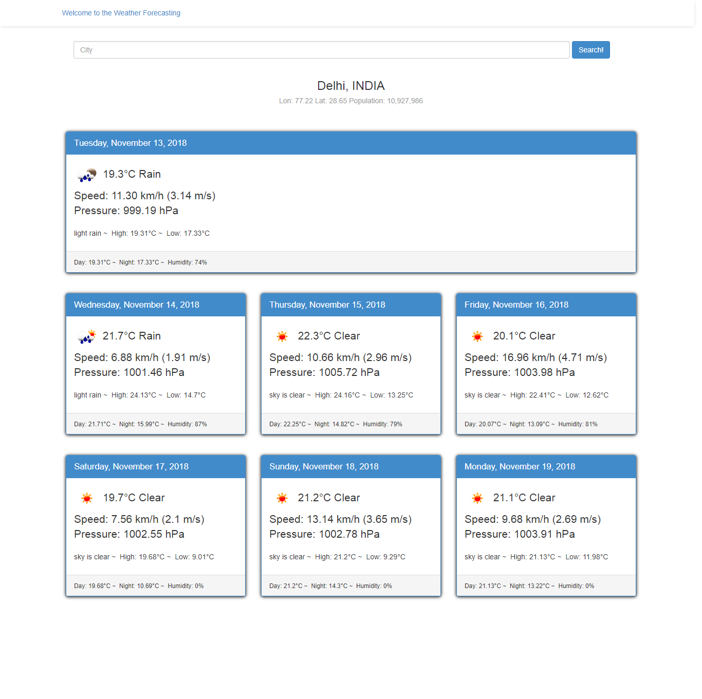

# angular-openweathermapForecasting

##Execute the program through command line

  >**npm start**

  >**Open Web Brower**

>Type in URL 
http://localhost:8000/app/index.html#/forecast

Open Weather Application will be Run in the browser

##**First you have to install:-**

>node js

>angular js

  ##**OUTPUT**
  
